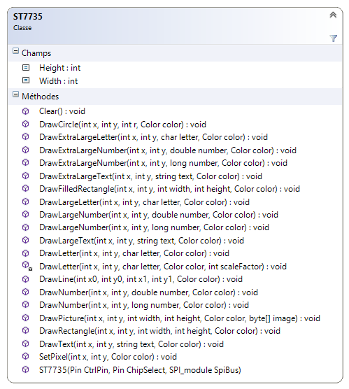
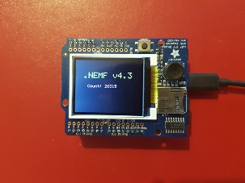

# ST7735

## Description

Source code.

A **.NETMF v4.3 class** write for a ST7735 circuit : **262K Color Single-Chip TFT Controller/Driver**. 

This class is also in the [MicroToolsKit](https://www.nuget.org/packages/WEBGE.Microtoolskit/) **library**. Download at [nuget.org](https://www.nuget.org).

## Hardware

**Targets**: Netduino, Netduino2 plus, Netduino 3, FEZ PANDA 3 and COBRA 3.

## Software

* **Language** : C#
* **Framework used** : .NETMF 4.3
* **IDE** : Visual Studio Community 2013 (2015)
* **xml** : documentation inside class

## Visual Studio solution

* **ST7735**
  * **ST7735** : .NetMF class

* **Color** : .NetMF class

* **Netduino** : class test program for Netduino board
* **FezPanda** : class test program for Fez Panda board 

## Assembly

  

## Videos

to come up

## Keywords

I²C Bus, Netduino, FEZ, PANDA, COBRA, C#, NETMF, Visual Studio.

## Tested on

Fez Panda III, Netduino2 plus

## Todo list

* fill circle
* draw and fill triangle
* rotation screen
* draw bitmap

## To get started

See [ST7735 GitHub Pages](http://webge.github.io/ST7735/) (in French).

## Feed on Google+

* [C# embarqué et .NetMF v4.3 : Netduino et GHI FEZ](https://plus.google.com/collection/oaaJX) (French).

## Wiki

* [C# embarqué et .NetMF v4.3 pour les cartes Netduino et GHI FEZ](http://webge.dyndns-server.com/dokuwiki/doku.php?id=netmf43:accueilnetmf) (French).

## Project site

* [MicroToolsKit library](http://webge.dyndns-server.com/dokuwiki/doku.php?id=netmf43:6_microtoolskit) (English)

**Maintened by** [WebGe](mailto:philippemariano@gmail.com)
